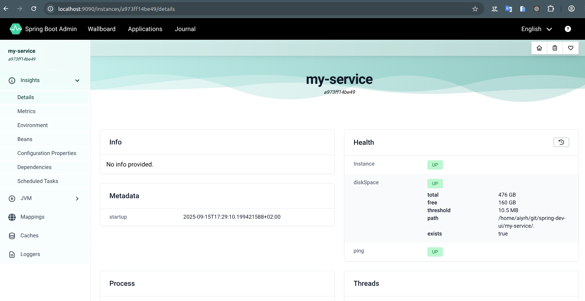
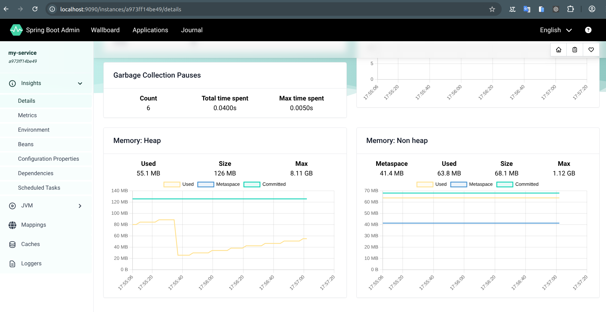
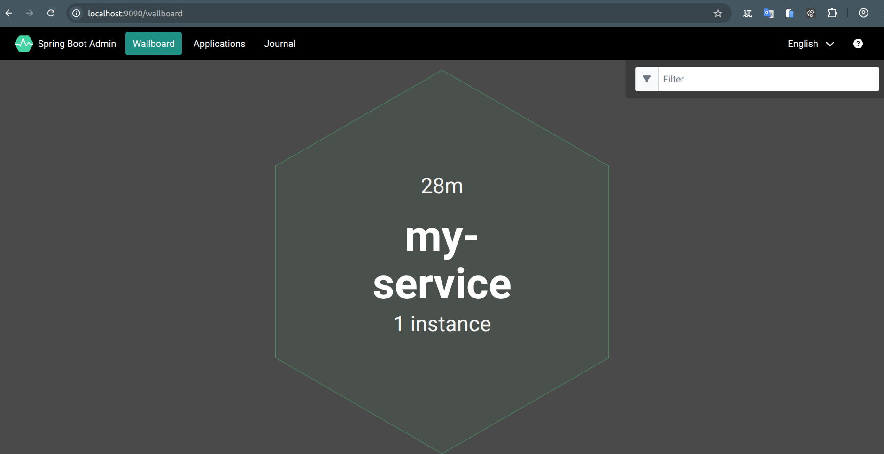
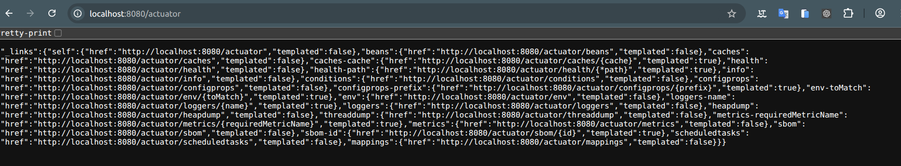

# Spring project based having a spring-dev-ui


## Introduction

Two Spring Boot projects to emulate a Quarkus Dev UI experience using **Actuator + Spring Boot Admin (UI) + Swagger UI**.

## Projects
- `admin-server` — the Spring Boot Admin UI (runs on port 9090).
- `my-service` — your app exposing Actuator & registering with the Admin UI (runs on port 8080).

## Requirements
- Java 21+
- Maven 3.9+

## How to run

### 1) Start the Admin UI
```bash
cd admin-server
mvn spring-boot:run
```
#### Admin Server UI: 
http://localhost:9090





### 2) Start your service (dev profile)
In another terminal:
```bash
cd my-service
mvn spring-boot:run -Dspring-boot.run.profiles=dev
```

#### Swagger UI: 
http://localhost:8080/swagger-ui


#### Actuator: 
http://localhost:8080/actuator



Your service will automatically register in the Admin UI.
From the Admin dashboard you can inspect health, env/config, beans, mappings, caches, scheduled tasks, metrics, and change log levels at runtime.

> **Security (dev only):** This setup exposes all Actuator endpoints without auth. Lock this down for any non-dev environment.


## Author

- Wallace Espindola, Sr. Software Engineer / Solution Architect / Java & Python Dev
- **LinkedIn:** [linkedin.com/in/wallaceespindola/](https://www.linkedin.com/in/wallaceespindola/)
- **GitHub:** [github.com/wallaceespindola](https://github.com/wallaceespindola)
- **E-mail:** [wallace.espindola@gmail.com](mailto:wallace.espindola@gmail.com)
- **Twitter:** [@wsespindola](https://twitter.com/wsespindola)
- **Gravatar:** [gravatar.com/wallacese](https://gravatar.com/wallacese)
- **Dev Community:** [dev.to/wallaceespindola](https://dev.to/wallaceespindola)
- **DZone Articles:** [DZone Profile](https://dzone.com/users/1254611/wallacese.html)
- **Pulse Articles:** [LinkedIn Articles](https://www.linkedin.com/in/wallaceespindola/recent-activity/articles/)
- **Website:** [W-Tech IT Solutions](https://www.wtechitsolutions.com/)
- **Presentation Slides:** [Speakerdeck](https://speakerdeck.com/wallacese)

## License

- This project is released under the Apache 2.0 License.
- See the [LICENSE](LICENSE) file for details.
- Copyright © 2025 [Wallace Espindola](https://github.com/wallaceespindola/).