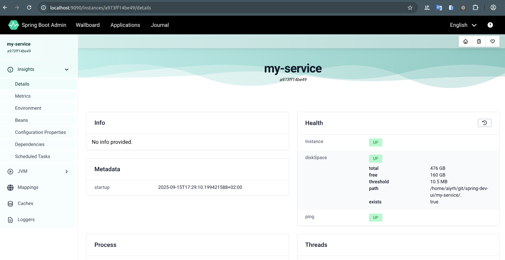
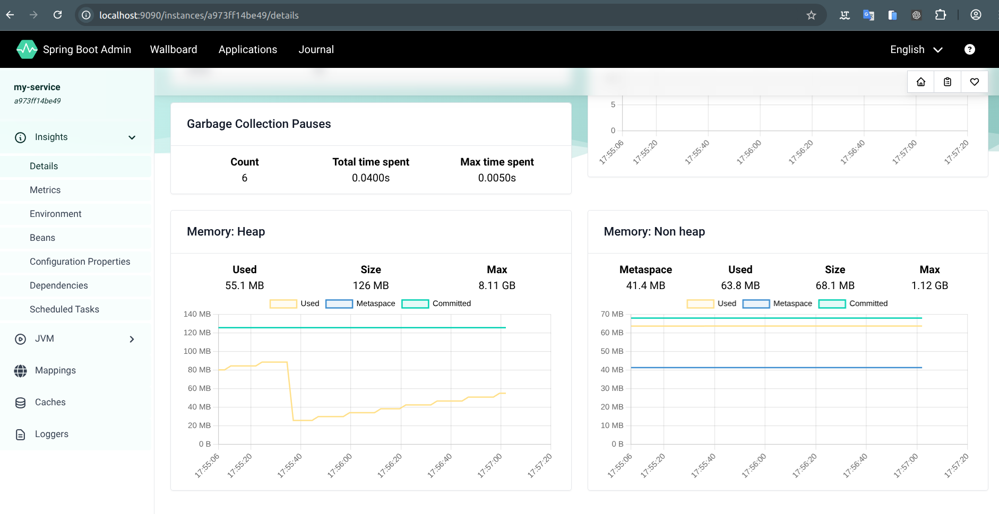
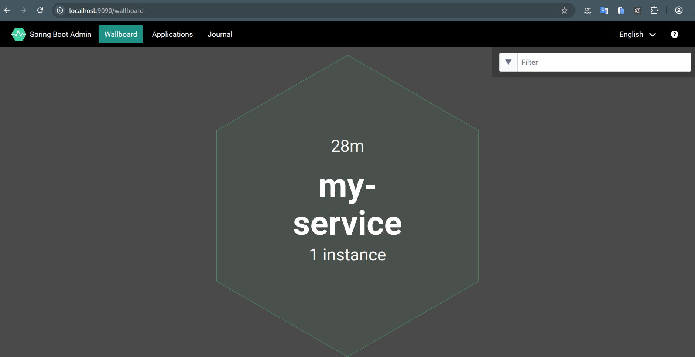
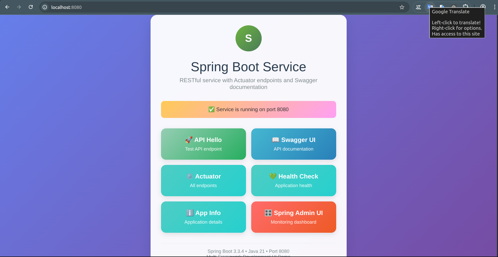
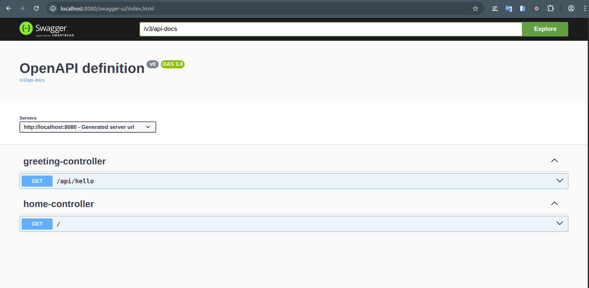
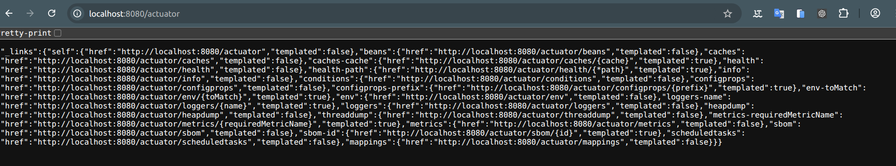
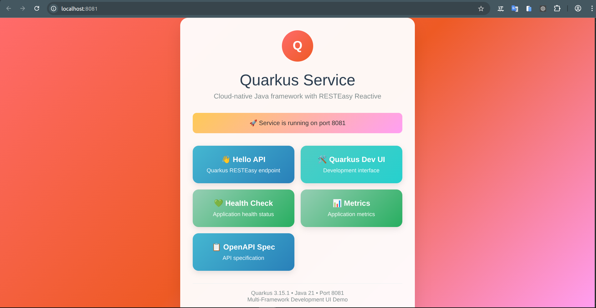
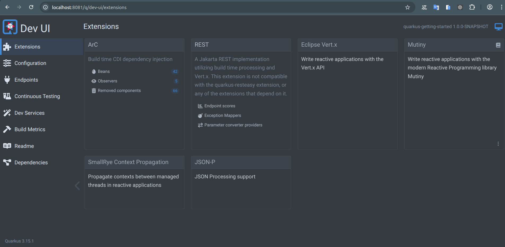
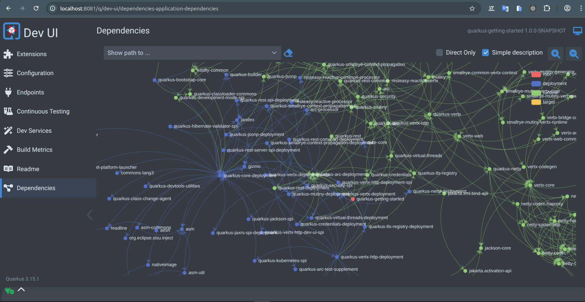

# Multi-Framework Development UI Demo


## Introduction

This project demonstrates three different frameworks working together:
- **Spring Boot Admin UI Service** - centralized monitoring and management UI
- **Spring Boot Service** - RESTful service with Actuator endpoints and Swagger documentation
- **Quarkus Service** - cloud-native Java framework service

The Spring projects emulate a Quarkus Dev UI experience using **Actuator + Spring Boot Admin (UI) + Swagger UI**.

## Projects Structure
- `spring-admin-ui` — Spring Boot Admin UI for monitoring (runs on port 9090)
- `spring-service` — Spring Boot app exposing Actuator & registering with Admin UI (runs on port 8080)
- `quarkus-service` — Quarkus application with RESTEasy Reactive (runs on port 8081)

## Requirements
- Java 21+
- Maven 3.9+

## How to Run All Projects

### Method 1: Quick Start Script (Recommended)
Use the provided script to start all three projects simultaneously in separate terminals:

```bash
./start-all.sh
```

This script will automatically:
- Open 3 separate terminal windows
- Start Spring Admin UI Service on port 9090
- Start Spring Service on port 8080
- Start Quarkus Service on port 8081
- Display all access URLs

### Method 2: Manual Start (All Projects)
Run all projects simultaneously in separate terminals:

```bash
# Terminal 1 - Start Spring Admin UI Service
cd spring-admin-ui && mvn spring-boot:run

# Terminal 2 - Start Spring Service  
cd spring-service && mvn spring-boot:run -Dspring-boot.run.profiles=dev

# Terminal 3 - Start Quarkus Service
cd quarkus-service && mvn quarkus:dev
```

### Method 3: Step-by-Step Instructions

#### 1) Start the Spring Admin UI Service
```bash
cd spring-admin-ui
mvn spring-boot:run
```
**Spring Admin UI Service:** http://localhost:9090





#### 2) Start the Spring Service (with dev profile)
In another terminal:
```bash
cd spring-service
mvn spring-boot:run -Dspring-boot.run.profiles=dev
```

**Spring Service Endpoints:**
- **Home:** http://localhost:8080 (Hello from Spring Service)
- **API Hello:** http://localhost:8080/api/hello
- **Swagger UI:** http://localhost:8080/swagger-ui
- **Actuator:** http://localhost:8080/actuator
- **Health:** http://localhost:8080/actuator/health
- **Info:** http://localhost:8080/actuator/info





Your service will automatically register with the Spring Admin UI for monitoring.

#### 3) Start the Quarkus Service
In another terminal:
```bash
cd quarkus-service
mvn quarkus:dev
```

**Quarkus Service Endpoints:**
- **API:** http://localhost:8081/hello
- **Dev UI:** http://localhost:8081/q/dev/ (available in dev mode)
- **Health:** http://localhost:8081/q/health





### Alternative Quarkus Run Options

**Development mode (recommended):**
```bash
cd quarkus-service
mvn compile quarkus:dev
```

**Package and run:**
```bash
cd quarkus-service
mvn package
java -jar target/quarkus-app/quarkus-run.jar
```

## Project Access URLs

| Service | URL | Description |
|---------|-----|-------------|
| Spring Admin UI | http://localhost:9090 | Centralized monitoring dashboard |
| Spring Service Home | http://localhost:8080 | Hello from Spring Service |
| Spring API Hello | http://localhost:8080/api/hello | Spring Boot API endpoint |
| Spring Swagger UI | http://localhost:8080/swagger-ui | API documentation interface |
| Spring Actuator | http://localhost:8080/actuator | All actuator endpoints |
| Spring Health | http://localhost:8080/actuator/health | Application health status |
| Spring Info | http://localhost:8080/actuator/info | Application information |
| Quarkus Service | http://localhost:8081/hello | Quarkus RESTEasy endpoint |
| Quarkus Dev UI | http://localhost:8081/q/dev/ | Quarkus development interface |
| Quarkus Health | http://localhost:8081/q/health | Quarkus health check |

## Features

### Spring Boot Admin UI Service
- Real-time application monitoring
- Health status visualization  
- Memory and CPU metrics
- Log level management
- Environment variable inspection
- Bean and mapping exploration

### Spring Service
- RESTful API with Swagger documentation
- Actuator endpoints for monitoring
- Automatic registration with Admin Service
- Development profile configuration

### Quarkus Service
- Fast startup and low memory footprint
- Live reload in development mode
- Built-in health checks
- Native compilation support (GraalVM)

## Technology Stack

### Framework Versions
- **Java:** 21
- **Spring Boot:** 3.3.4
- **Spring Boot Admin:** 3.3.3
- **Quarkus:** 3.15.1
- **SpringDoc OpenAPI:** 2.6.0
- **Maven:** 3.9+

### Key Dependencies
- Spring Boot Starter Web
- Spring Boot Starter Actuator
- Spring Boot Admin (Server & Client)
- SpringDoc OpenAPI UI
- Quarkus RESTEasy Reactive
- Quarkus Arc (CDI)

## Development Notes

> **Security (dev only):** This setup exposes all Actuator endpoints without authentication. Secure these endpoints for production environments.

> **Port Configuration:** The Quarkus Service runs on port 8081 by default (configured in `quarkus-service/src/main/resources/application.properties`) to avoid conflicts with the Spring service on port 8080.

> **Auto-reload:** Both Spring Boot (with DevTools) and Quarkus (dev mode) support automatic reloading when code changes are detected.

## Author

- Wallace Espindola, Sr. Software Engineer / Solution Architect / Java & Python Dev
- **LinkedIn:** [linkedin.com/in/wallaceespindola/](https://www.linkedin.com/in/wallaceespindola/)
- **GitHub:** [github.com/wallaceespindola](https://github.com/wallaceespindola)
- **E-mail:** [wallace.espindola@gmail.com](mailto:wallace.espindola@gmail.com)
- **Twitter:** [@wsespindola](https://twitter.com/wsespindola)
- **Gravatar:** [gravatar.com/wallacese](https://gravatar.com/wallacese)
- **Dev Community:** [dev.to/wallaceespindola](https://dev.to/wallaceespindola)
- **DZone Articles:** [DZone Profile](https://dzone.com/users/1254611/wallacese.html)
- **Pulse Articles:** [LinkedIn Articles](https://www.linkedin.com/in/wallaceespindola/recent-activity/articles/)
- **Website:** [W-Tech IT Solutions](https://www.wtechitsolutions.com/)
- **Presentation Slides:** [Speakerdeck](https://speakerdeck.com/wallacese)

## License

- This project is released under the Apache 2.0 License.
- See the [LICENSE](LICENSE) file for details.
- Copyright © 2025 [Wallace Espindola](https://github.com/wallaceespindola/).